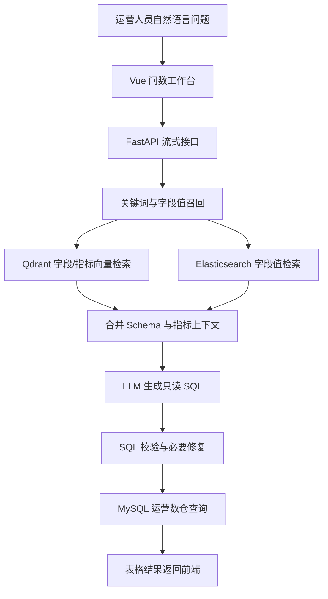

# DataAgent | 海外运营智数平台 

> 面向海外 AI App 运营场景的自然语言问数系统，基于 Schema RAG、指标口径召回和只读 SQL 校验，将国家、渠道、版本、产品线维度的运营问题转化为可解释的数据查询结果。

> 

海外运营智数平台是一个面向海外 AI App 运营场景的自然语言问数系统。运营人员可以用中文直接询问国家、渠道、版本、语言、产品线和时间周期下的核心指标，系统会召回数仓 Schema 与指标口径，生成只读 SQL，校验后返回结构化表格结果。

这个项目用于展示“自然语言问数 + Schema RAG + SQL 安全校验”在 AI 出海业务中的落地链路，重点覆盖海外运营常见的 DAU、留存、订阅转化、广告变现、崩溃率、差评率和应用商店评分等分析问题。

## 业务场景

海外 AI App 运营团队需要频繁回答这些问题：

- 美国市场最近 30 天 DAU 和订阅转化率是否变化？
- TikTok Ads 带来的新用户次日留存怎么样？
- 3.2.0 版本上线后一周崩溃率是否上升？
- 各国家广告收入和 eCPM 排名如何？
- 西班牙语市场的差评率主要来自哪些版本？

传统方式依赖数据同学写 SQL，沟通成本高，指标口径容易不一致。平台把运营问题解析为指标、维度、时间范围和过滤条件，并通过元数据知识库约束 SQL 生成范围。

## 核心能力

- 自然语言问数：支持运营人员用中文提出指标查询、趋势分析、排名对比和版本复盘问题。
- Schema RAG：从字段、字段值和指标知识中召回相关上下文，降低模型编造表字段的概率。
- 指标口径约束：在 `conf/meta_config.yaml` 中维护 DAU、D1/D7 留存、订阅转化、广告收入、ARPDAU、崩溃率、差评率等口径。
- SQL 安全校验：只允许生成查询 SQL，并在执行前通过数据库 `EXPLAIN` 校验。
- 流式执行反馈：前端展示理解问题、召回指标、生成 SQL、查询数仓等执行阶段。
- 业务样例数据：`sql/seed_overseas_ai_app.sql` 提供海外 AI App 运营数仓示例表和种子数据。

## 演示范围

- 支持国家、渠道、版本、产品线与时间周期下的趋势、排名、对比和版本复盘问题。
- 当前数据域覆盖用户活跃、订阅收入、广告变现、应用质量和商店评论。
- 项目以本地 Docker 依赖和临时公网隧道提供可复现演示，不宣称为生产多租户服务。

## 技术链路



## 数仓模型

维度表：

- `dim_date`：日期、周、月、季度
- `dim_country`：国家、区域、主要语言、市场层级
- `dim_channel`：TikTok Ads、Meta Ads、Google Ads、Organic、App Store Search
- `dim_app_version`：版本号、平台、发布日期
- `dim_product`：AI Chat Assistant、AI Image Studio、AI Writing Copilot

事实表：

- `fact_user_activity_daily`：DAU、新增用户、D1/D7 留存用户、会话数
- `fact_subscription_daily`：试用、付费订阅、续费、退款、订阅收入
- `fact_ad_revenue_daily`：广告展示、点击、广告收入、eCPM
- `fact_app_quality_daily`：总会话、崩溃会话、错误数、启动耗时
- `fact_store_review_daily`：评论量、差评量、评分总和

## 本地运行

### 环境要求

- Python 3.12+
- Node.js 20+
- Docker Desktop
- 可用的 LLM API Key
- 可选：`cloudflared`，用于手机临时公网演示

### 1. 启动依赖服务

项目依赖 MySQL、Qdrant、Elasticsearch 和 Embedding 服务。按你本地已有方式启动这些服务，并确保 `conf/app_config.yaml` 中的连接信息可用。

默认配置：

- MySQL：`localhost:3307`
- DW 数据库：`dw2`
- Meta 数据库：`meta2`
- Qdrant：`127.0.0.1:6333`
- Elasticsearch：`localhost:9200`
- Embedding 服务：`localhost:8081`

### 2. 初始化海外运营演示数仓

在 MySQL 中执行：

```bash
mysql -h localhost -P 3307 -u atguigu -p < sql/seed_overseas_ai_app.sql
```

脚本会创建 `dw2` 数据库下的维度表、事实表和示例数据。

### 3. 构建元数据知识库

在后端项目根目录执行：

```bash
python app/scripts/build_meta_knowledge.py
```

该脚本会读取 `conf/meta_config.yaml`，同步表字段和指标信息到 meta 库，并写入 Qdrant/Elasticsearch 检索索引。

### 4. 启动后端

```bash
.\scripts\start.ps1
```

该脚本会启动 MySQL、Qdrant、Elasticsearch、Embedding 容器，并在需要时启动后端和前端。首次运行前，复制 `.env.example` 为 `.env`，再填入本机数据库密码与 LLM API Key。`.env` 已被 Git 忽略，不能提交或发送给他人。

本地演示地址：

```text
http://127.0.0.1:5173/
```

后端 API 文档：`http://127.0.0.1:8000/docs`

### 5. 手机临时公网演示

安装 Cloudflare Tunnel（只需首次安装）：

```powershell
winget install --id Cloudflare.cloudflared
```

本地服务已启动后，另开一个 PowerShell 窗口运行：

```powershell
.\scripts\start-tunnel.ps1 -Background
```

控制台会输出一个 `https://*.trycloudflare.com` 地址。手机可直接访问该地址，不需要与电脑在同一 Wi-Fi。演示期间电脑、Docker、前后端服务和隧道进程必须保持运行；关闭隧道、电脑休眠或网络中断后，地址会立即失效，重启隧道会生成新地址。若希望在当前窗口查看隧道日志，可不带 `-Background` 参数运行。

本方案只开放前端入口，`/api` 请求由本机前端代理到后端；MySQL、Qdrant、Elasticsearch、Embedding 不直接暴露到公网。

### 6. 停止演示

```powershell
.\scripts\stop.ps1
```

该命令只停止脚本启动的前后端。若还要关闭依赖容器：

```powershell
.\scripts\stop.ps1 -StopDependencies
```

若还需关闭后台隧道：

```powershell
.\scripts\stop.ps1 -StopTunnel
```

## 安全说明

- 不要提交 `.env`、日志、数据库导出、Cloudflare 隧道日志或 IDE 配置。
- 仅使用 [.env.example](.env.example) 作为配置模板；真实数据库密码和 LLM API Key 仅保存在本机 `.env`。
- 若任何密钥曾提交到 Git 历史，应在对应平台立即轮换；删除工作区文件无法清除已公开的历史记录。
- 临时公网隧道只代理前端入口，数据服务端口不应暴露到公网。

## 验证

```powershell
# 后端静态检查
.venv\Scripts\python.exe -m compileall app main.py

# 前端生产构建
cd frontend
npm run build
```

本地启动后，可在前端执行：`各国家广告收入排名前10`。系统应依次返回运营意图、Schema/指标召回、只读 SQL 校验和按国家聚合的广告收入结果。

## 常用分析问题

可直接在前端输入或点击左侧示例：

- 过去30天美国市场 DAU 和订阅转化率趋势
- 各国家广告收入排名前10
- 3.2.0版本上线后一周崩溃率是否上升
- TikTok Ads渠道的新用户次日留存怎么样
- 西班牙语市场差评率最高来自哪些版本
- 按渠道对比 AI Chat Assistant 的 ARPDAU

## 项目亮点

- 不是通用聊天 Demo，而是围绕海外 AI App 运营指标体系设计的问数链路。
- 将业务元数据、指标口径、字段值召回和 SQL 生成串成可运行流程。
- 前端展示的是运营人员关心的执行过程，而不是单纯等待模型回答。
- 样例数据覆盖国家、语言、渠道、版本、产品线和多类运营事实表，便于面试中讲清楚业务闭环。

## 目录说明

```text
InsightQuery
├── app/                         # FastAPI、LangGraph 节点、仓储与服务层
├── conf/
│   ├── app_config.yaml           # 本地服务连接配置
│   └── meta_config.yaml          # 海外运营数仓 Schema 与指标口径
├── frontend/                     # Vue 问数工作台
├── prompts/                      # SQL 生成、召回扩展、筛选和修复 Prompt
├── sql/
│   └── seed_overseas_ai_app.sql  # 海外 AI App 运营样例数据
└── main.py                       # 后端启动入口
```
